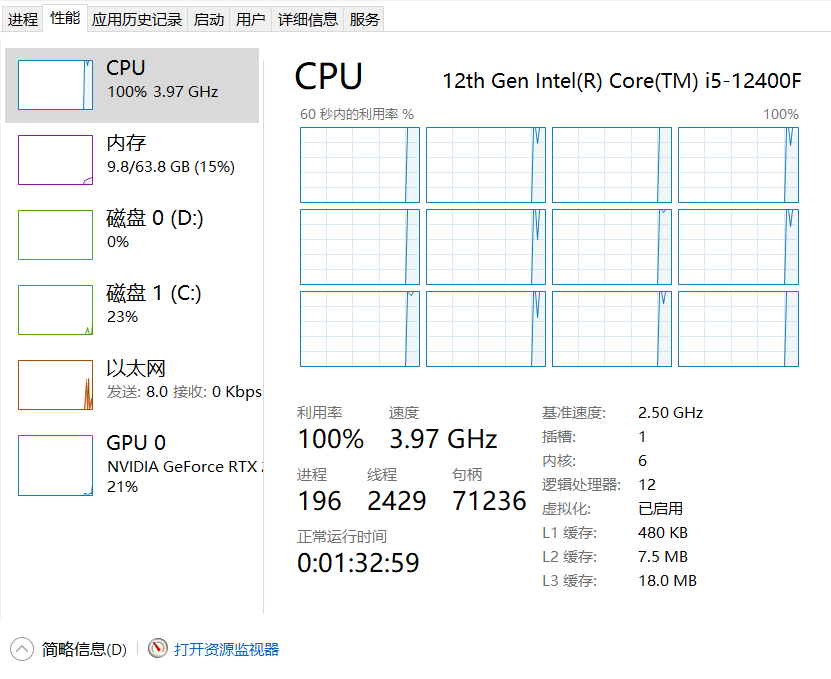
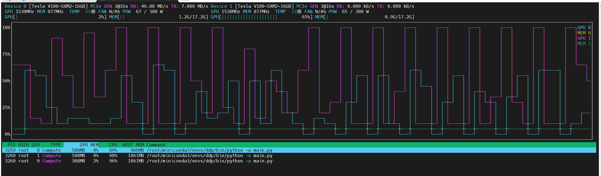

# ddp-demo

Pytorch DDP 分布式训练示例.

关键在于理解torch底层的集合通讯原语.

# 运行

pytorch不要安装>=2.4，建议选择2.3版本，高版本底层有点变化还不稳定.

**下面运行cpu版本**

```
torchrun --nproc-per-node 8 singlenode_cpu.py
```

**CPU负载**


**训练输出**
```
train_loss:0.24917156994342804 val_loss:0.25485239593318093
train_loss:0.07825594395399094 val_loss:0.1874487167105269
train_loss:0.1320413500070572 val_loss:0.15735604718160895
train_loss:0.18538059294223785 val_loss:0.1324689341768527
train_loss:0.10964973270893097 val_loss:0.12027552388251399
train_loss:0.08650851994752884 val_loss:0.10963827594608878
train_loss:0.09874849766492844 val_loss:0.09775157950776882
train_loss:0.08473105728626251 val_loss:0.08595881488221807
train_loss:0.06794360280036926 val_loss:0.08419526592730142
train_loss:0.026617610827088356 val_loss:0.0894221157827132
train_loss:0.05533814802765846 val_loss:0.08421825649463735
train_loss:0.021015755832195282 val_loss:0.0815157651834855
train_loss:0.02977871149778366 val_loss:0.08217136068909336
train_loss:0.01779726706445217 val_loss:0.08249559141948415
train_loss:0.07576984167098999 val_loss:0.08703947944680791
train_loss:0.011644292622804642 val_loss:0.08359094338293319
train_loss:0.02614809386432171 val_loss:0.09171752198258959
train_loss:0.005597482435405254 val_loss:0.09280980454863624
train_loss:0.024241376668214798 val_loss:0.08535158351878636
train_loss:0.003442130982875824 val_loss:0.08844634933894775
```

**下面运行gpu版本**

```
torchrun --nproc-per-node 2 singlenode_gpu.py
```

**GPU负载**



**训练输出**

```
train_loss:0.08585123717784882 val_loss:0.15821034498453235
train_loss:0.04274160414934158 val_loss:0.11166235524863481
train_loss:0.019771497696638107 val_loss:0.09422017955414641
train_loss:0.09019044786691666 val_loss:0.09446129071029326
train_loss:0.09621671587228775 val_loss:0.07959854137078047
train_loss:0.04162154719233513 val_loss:0.07437744689956545
train_loss:0.07522722333669662 val_loss:0.08188239059542282
train_loss:0.002014747355133295 val_loss:0.07646776500106685
train_loss:0.0018418291583657265 val_loss:0.07617293855980334
train_loss:0.006784400437027216 val_loss:0.08290687653703054
train_loss:0.04486997053027153 val_loss:0.08682108365375692
train_loss:0.0017010598676279187 val_loss:0.10362097959156605
train_loss:0.0018368593882769346 val_loss:0.09146277327323542
train_loss:0.007668677251785994 val_loss:0.09393906897135681
train_loss:4.151080793235451e-05 val_loss:0.09868318892170293
train_loss:0.0008594690007157624 val_loss:0.10407997771724219
train_loss:0.00463233795017004 val_loss:0.09610629375036663
train_loss:2.2827329303254373e-05 val_loss:0.09919017490187726
train_loss:0.02090940810739994 val_loss:0.10843215247780008
train_loss:0.0014010221930220723 val_loss:0.11312693469343373
```


# 参考资料

* [Pytorch DDP原理](https://blog.csdn.net/flyingluohaipeng/article/details/127910459)
* [What is the proper way to checkpoint during training when using distributed data parallel (DDP) in PyTorch?](https://discuss.pytorch.org/t/what-is-the-proper-way-to-checkpoint-during-training-when-using-distributed-data-parallel-ddp-in-pytorch/139575/1)
* [DistributedDataParallel barrier doesn’t work as expected during evaluation](https://discuss.pytorch.org/t/distributeddataparallel-barrier-doesnt-work-as-expected-during-evaluation/99867)
* [[源码解析] PyTorch 分布式(4)------分布式应用基础概念](https://www.cnblogs.com/rossiXYZ/p/15546837.html)